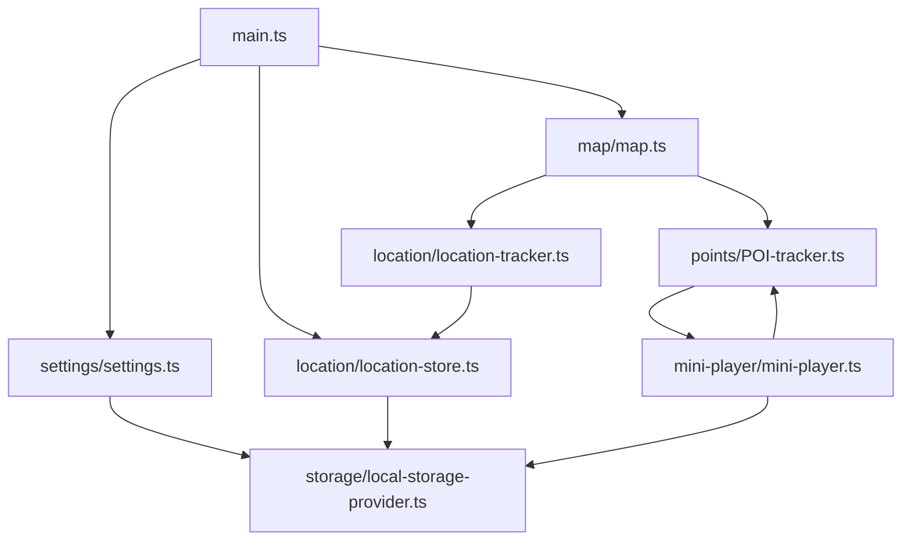

## Overview

This project is a **Leaflet-based interactive map** implemented in TypeScript and bundled with Vite. It renders a map with multiple tile layers, displays a set of Points of Interest (POIs), offers an image/audio mini‑player for POI media, tracks device location over time, and exposes a small settings menu that can clear stored data.

The runtime wiring happens in `src/main.ts`, which:

- Initializes the settings menu UI.
- Configures and renders the Leaflet map with layers and POI markers.
- Wires the POI tracker and mini‑player to marker clicks.
- Instantiates location tracking and periodically persists location history to `localStorage`.

---

## Project structure

### Entry point

- **`src/main.ts`**
  - Imports map configuration (`./map/layers`, `./map/map`), POIs (`./points`), styles, Leaflet extensions, settings (`./settings`), and the location store (`./location`).
  - Calls `initSettingsMenu()` to wire up the settings pane.
  - Calls `initMap({ POIs, initialLocation, initialZoom, defaultLayer, layers })` to create the Leaflet map, add tile layers, and render POIs.
  - Sets a `setInterval` to call `locationStoreInstance.saveToStorage()` every 15 seconds, persisting location history.

### Map and layers

- **`src/map/map.ts`**
  - Defines `initMap(config)` which:
    - Creates a Leaflet map with rotation enabled and custom options.
    - Sets the initial view (`initialLocation`, `initialZoom`).
    - Adds the default tile layer and, if configured, a layer control (`L.control.layers`).
    - Iterates over `config.POIs` to create markers with the `poiMarker` icon and wires marker clicks to `poiTrackerInstance.select(POI)`.
    - Listens for map `click` events to call `poiTrackerInstance.deselectActive()` when clicking outside any marker.
    - Instantiates `new LocationTracker()`, adds `locationTracker.layer` to the map, and subscribes `locationTracker.zoomAnimationCallback` to `map.on("move", ...)`.
    - Works around Safari viewport quirks by calling `map.invalidateSize()` on first interaction and via delayed timeouts.

- **`src/map/layers.ts`**
  - Defines and exports `mapLayers` (e.g., OSM, satellite) as `TileLayer` instances.
  - Used by `main.ts` to pick the default layer and provide optional layer controls.

- **`src/map/components/poi-marker.ts`**
  - Builds a `DivIcon` for POI markers, including:
    - A numeric label based on POI index.
    - A DOM `id` derived from `markerIdForPOI(poi)` so markers can be found via `document.getElementById`.

- **`src/map/components/poi-popup.ts`**
  - Provides a small HTML string for a POI popup (currently not wired into `initMap`).

### POIs and POI tracking

- **`src/points/POIs.ts`**
  - Contains the static list of POIs (`POI[]`) with `id`, `title`, `location.{latitude, longitude}`, and optional `imageName` / `audioName`.

- **`src/points/POI-tracker.ts`**
  - `POITracker` manages:
    - `activePOI`: the currently selected POI.
    - `viewed`: a `Set<POI>` tracking which POIs have been seen.
  - `select(poi)`:
    - Early-returns if the same POI is already active.
    - Calls `this.deselectActive()`, sets `this.activePOI`, and adds the POI to `viewed`.
    - Uses `getElementOrThrow({ id: markerIdForPOI(poi) })` to find the marker DOM element and dims it (`style.opacity = "0.7"`).
    - Calls `miniPlayerInstance.display(poi)` to show the mini‑player for that POI.
  - `deselectActive()`:
    - Clears `activePOI` and, if the mini‑player is visible, calls `miniPlayerInstance.close()`.
  - Exports a singleton `poiTrackerInstance` used by `map.ts` and the mini‑player.

### Mini‑player (image/audio UI)

- **`src/mini-player/mini-player.ts`**
  - `MiniPlayer` is responsible for:
    - Querying DOM elements for the mini‑player container, title, image, and audio element.
    - Wiring a close button to `this.close()`.
    - Rendering the currently active POI’s title, image, and audio.
  - `display(entry: POI)`:
    - Logs when switching between POIs.
    - Updates the title and image (`BASE_URL/images/...`), toggling visibility based on `imageName`.
    - If `audioName` is provided, configures the audio element (`BASE_URL/audio/...`) via `setupAudioElement`, which:
      - Loads/resumes from a timestamp stored in `LocalStorageProvider`.
      - Persists the timestamp on every `pause` event.
    - Shows the mini‑player container and marks it as not hidden.
  - `close()`:
    - Hides the container, tears down the audio element listener and saves the final timestamp.
    - Calls `poiTrackerInstance.deselectActive()` (creating a two‑way dependency with the POI tracker).
  - Exports a singleton `miniPlayerInstance`.

### Location tracking and history

- **`src/location/location-store.ts`**
  - `LocationStore` encapsulates:
    - `data: LocationPoint[]` (lat/long/accuracy/timestamp).
    - `previousDataLength` to avoid redundant writes.
  - On construction, reads from `LocalStorageProvider` under `StorageKeys.locationHistory`.
  - `maybeAdd(point)`:
    - If there is a previous point, uses Leaflet `distanceTo` to skip points closer than 1m.
  - `saveToStorage()`:
    - Writes JSON to `localStorage` only if the number of points has increased since the last save.
  - Exports a singleton `locationStoreInstance` used by `LocationTracker` and `main.ts`.

- **`src/location/location-tracker.ts`**
  - `LocationTracker`:
    - Starts `navigator.geolocation.watchPosition` in the constructor and stores `watchId`.
    - Listens for `document.visibilitychange` to pause/resume tracking when the document is hidden or shown.
    - Reads stored points from `locationStoreInstance.getAll()` to initialize a Leaflet `polyline` representing the path.
    - Creates a `L.layerGroup` combining the path (and later the accuracy circle) and exposes it as `this.layer`.
  - `zoomAnimaitonCallback()`:
    - On map `move` events, redraws `locationMarker` (if present) and `pathLine`, with a note that this may be expensive.
  - `handlePosition()`:
    - Updates the path polyline and manages a `L.circle` representing the current position and accuracy.
    - Calls `locationStoreInstance.maybeAdd(...)` to persist the point.
  - `handleError()`:
    - Logs geolocation errors with `info`.

### Settings and storage

- **`src/settings/settings.ts`**
  - `SettingsMenu`:
    - Wires navbar settings button to toggle a settings pane element.
    - Provides a close button that hides the pane.
    - Provides a “clear local storage” button that calls `LocalStorageProvider.clear()` (clears **all** local storage for the origin).
    - Contains a TODO for future settings persistence.
  - `initSettingsMenu()`:
    - Creates a module‑global `settingsMenuInstance`.

- **`src/storage/storage-provider.ts`**
  - Defines a `StorageProvider` interface with `set`, `get`, `has`, `getOrThrow`, and `clear`.

- **`src/storage/local-storage-provider.ts`**
  - Implements `StorageProvider` using `window.localStorage`, with some debug logging.
  - `clear(key?)`:
    - If called without `key`, clears the entire `localStorage`.

- **`src/storage/storage-keys.ts`**
  - Defines constant keys used for storage, e.g. `StorageKeys.locationHistory`.

### Utilities and types

- **`src/utils/logger.ts`**
  - Provides simple `debug`, `info`, and `warn` wrappers around `console`.

- **`src/utils/get-element-or-throw.ts`**
  - Helper `getElementOrThrow({ id } | { class })` that:
    - For `{ id }`, calls `document.getElementById(id)`.
    - For `{ class }`, also calls `document.getElementById(element.class)` (this is likely incorrect for classes; see smells below).

- **`src/types/POI.ts`**
  - Defines the `POI` type:
    - `location.{latitude, longitude}`.
    - Optional `imageName` and `audioName`.

- **`src/styles.css`**
  - Imports Tailwind.
  - Styles the map container, navbar, POI markers, the mini‑player layout, and the settings pane.

---

## High-level architecture

At runtime, the main relationships between modules can be summarized as:

Key characteristics:

- **Leaflet-centric UI**: Leaflet is used directly in feature classes (`map.ts`, `location-tracker.ts`) rather than being abstracted behind a rendering layer.
- **Global singletons**: Shared services (POI tracker, mini‑player, location store, settings menu) are exposed as module‑level singletons.
- **DOM-driven feature classes**: Each feature class (settings, mini‑player, POI tracker) directly queries DOM elements and attaches event listeners.

---

## Identified code smells and issues

### Circular dependency between POI tracker and mini‑player

- **Files**:
  - `src/points/POI-tracker.ts`
  - `src/mini-player/mini-player.ts`
- **Details**:
  - `POITracker.select()` imports and calls `miniPlayerInstance.display(poi)`.
  - `MiniPlayer.close()` imports and calls `poiTrackerInstance.deselectActive()`.
  - This creates a **two‑way dependency** and a circular module graph, making it harder to reason about who owns selection state and UI visibility.
  - Comments in `MiniPlayer.close()` already call this dependency chain “weird”, acknowledging the smell.

### Heavy reliance on global singletons

- **Files (examples)**:
  - `src/points/POI-tracker.ts` → `poiTrackerInstance`
  - `src/mini-player/mini-player.ts` → `miniPlayerInstance`
  - `src/location/location-store.ts` → `locationStoreInstance`
  - `src/settings/settings.ts` → `settingsMenuInstance` (module‑local)
- **Details**:
  - Features import and operate on shared singleton instances rather than being passed explicit dependencies.
  - This acts as an implicit **service locator**, coupling modules via hidden global state and making tests or alternate environments (e.g., SSR, headless tests) harder to implement.

### Mixed responsibilities (state, DOM, and UI intertwined)

- **Files (examples)**:
  - `src/points/POI-tracker.ts`
  - `src/mini-player/mini-player.ts`
  - `src/settings/settings.ts`
- **Details**:
  - `POITracker` is responsible for:
    - Domain state (`activePOI`, `viewed`).
    - DOM manipulation (finding marker elements and changing `style.opacity`).
    - Triggering UI behavior (`miniPlayerInstance.display` and `close` indirectly).
  - `MiniPlayer` manages:
    - DOM querying and event wiring.
    - Audio lifecycle and persistence.
    - Implicit coordination with `POITracker` selection state.
  - `SettingsMenu` couples settings UI behaviors with broad side effects (clearing all local storage).
  - This makes it difficult to test or reuse the **state transitions** independently of the DOM and UI.

### LocationTracker coupling geolocation, persistence, and rendering

- **Files**:
  - `src/location/location-tracker.ts`
  - `src/map/map.ts`
- **Details**:
  - `LocationTracker` is responsible for:
    - Managing geolocation (`watchPosition`, `clearWatch`).
    - Updating and persisting location history through `locationStoreInstance`.
    - Creating and managing Leaflet objects (`polyline`, `circle`, `layerGroup`) and exposing `layer` to be added to the map.
  - `map.ts` instantiates `new LocationTracker()` and integrates its `layer` into the map plus event callbacks.
  - This tightly couples the **data source** (user location history) with the **Leaflet rendering strategy**, limiting reuse in contexts without Leaflet and making the tracker harder to unit‑test.

### Potentially expensive redraw on every map move

- **File**:
  - `src/location/location-tracker.ts`
- **Details**:
  - `zoomAnimaitonCallback()` is attached to the map’s `move` event and always calls:
    - `this.locationMarker?.redraw()`
    - `this.pathLine.redraw()`
  - The code comment notes “this could be very expensive”.
  - On mobile pinch‑zoom or continuous map dragging, this may cause unnecessary redraws and degrade performance, especially with long paths.

### Leaky / buggy DOM helper for class lookup

- **File**:
  - `src/utils/get-element-or-throw.ts`
- **Details**:
  - For the `{ class: string }` branch, the helper still calls `document.getElementById(element.class)`:
    - This effectively treats the provided “class” name as an ID.
    - It will fail silently for real classes unless they happen to match an element’s `id`.
  - The function’s signature suggests it supports querying by class, but the implementation does not, which is confusing and error‑prone.

### Mini‑player audio listener lifecycle concerns

- **File**:
  - `src/mini-player/mini-player.ts`
- **Details**:
  - `setupAudioElement` registers a `pause` listener and returns it.
  - `MiniPlayer.display()`:
    - Creates a new listener each time a POI with audio is displayed.
    - Assigns the listener to `this.active.listener`.
  - `MiniPlayer.close()`:
    - Calls `teardownAudioElement` only if `this.active.listener` is set.
  - If the user navigates directly from one POI with audio to another **without closing** the mini‑player, there is no teardown of the previous listener before the new one is added, which can lead to lingering listeners and duplicated persistence logic.

### Inconsistent naming and spelling (resolved)

- **Files (examples)** — spellings have been corrected:
  - `src/types/POI.ts` uses `latitude` (was `lattitude`).
  - `src/map/map.ts` uses `MapConfiguration` (was `MapConfiguartion`).
  - `src/map/components/poi-marker.ts` uses `IconConfiguration` (was `IconConfiguartion`).
  - `src/map/components/poi-popup.ts` uses `PopupConfiguration` (was `PopupConfiguartion`).
- **Details**:
  - The codebase now uses consistent `latitude`/`longitude` and `*Configuration` naming throughout.

### Overly generic or unused types

- **File**:
  - `src/mini-player/mini-player.ts`
- **Details**:
  - `type AudioElementWithController = HTMLAudioElement & { controller: AbortController; };`
    - The `controller` property is never set or used.
    - This suggests an incomplete or abandoned abstraction and may mislead future contributors into expecting additional behavior.

### Settings clearing entire localStorage

- **File**:
  - `src/settings/settings.ts`
- **Details**:
  - The “clear local storage” button calls `LocalStorageProvider.clear()` **without a key**, which wipes the entire `localStorage` for the origin.
  - This is acceptable in a fully isolated app but becomes problematic if the origin is shared with other applications or if additional, unrelated data is later stored under the same origin.
  - Architecturally, this UI action has very broad side effects and is not scoped to data owned by this app (e.g., under a dedicated namespace).

---

## Suggested improvements (high level)

### Break the POI tracker ↔ mini‑player cycle

- Introduce a **mediator** or **event bus** between selection logic and UI:
  - `POITracker` would emit events like `onPOISelected(poi)` and `onPOIDeselected()`.
  - `MiniPlayer` would subscribe to these events and update the UI, instead of being called directly.
- Alternatively, invert the dependency:
  - Have `main.ts` or a dedicated “composition root” wire `POITracker` and `MiniPlayer` together via callbacks, so the two classes do not import each other.

### Replace global singletons with explicit wiring

- Prefer creating instances in a top‑level composition function (e.g., in `main.ts`) and passing them as arguments:
  - Example: `initMap({ POIs, ..., poiTracker, locationTracker })` instead of relying on `poiTrackerInstance` and `new LocationTracker()` inside `map.ts`.
- For shared services like storage or location history:
  - Define interfaces and inject concrete implementations where needed.
  - This makes components easier to test and to replace in different environments.

### Separate domain logic from DOM and rendering

- Extract **pure state/domain logic** into small, framework‑agnostic classes or functions:
  - Example: a `POISelectionStore` managing `activeId` and `viewedIds`, with no DOM or mini‑player knowledge.
  - Example: a `LocationHistoryService` that understands geolocation updates and persistence, but not Leaflet.
- Keep DOM interactions in thin adapter layers:
  - UI classes (or future components) would observe domain state and update DOM/Leaflet accordingly.
  - This improves testability (you can test logic without a DOM) and makes migration to other UI frameworks easier.

### Decouple LocationTracker from Leaflet specifics

- Split responsibilities into:
  - A **geolocation service** that:
    - Manages `watchPosition` / `clearWatch`.
    - Streams `LocationPoint` updates and handles errors.
    - Interacts with `LocationStore` for persistence.
  - A **map layer builder** that:
    - Consumes location updates and maintains Leaflet primitives (`polyline`, `circle`).
    - Exposes clean methods like `attachTo(map)` and `detachFrom(map)`.
- This separation lets you reuse geolocation/persistence logic without Leaflet and test it independently.

### Optimize map move redraw behavior

- Consider **throttling** or **debouncing** `zoomAnimationCallback` for map `move` events:
  - For example, only redraw at a fixed interval or after movement settles.
- Re‑evaluate whether redrawing the entire path on every move is necessary:
  - If Leaflet’s built‑in vector handling suffices, `pathLine.redraw()` might be removed or limited to specific scenarios (e.g., only on zoom end).

### Fix and clarify DOM helper semantics

- Update `getElementOrThrow` so that:
  - `{ id }` continues to use `getElementById`.
  - `{ class }` uses `document.querySelector` / `getElementsByClassName` and either:
    - Returns the first match, or
    - Returns all matches (changing the return type).
- Alternatively, limit the helper to ID lookups only and remove the `{ class }` overload to avoid misleading call sites.

### Improve mini‑player audio lifecycle management

- Ensure previous listeners are cleaned up when switching between POIs:
  - Before setting up a new audio listener in `display`, check `this.active.listener` and call `teardownAudioElement` if present.
- Consider encapsulating audio persistence behavior:
  - A small `AudioProgressStore` that listens to pause and writes timestamps, which can be attached/detached cleanly.

### Normalize naming and clean up types

- ~~Standardize on `latitude` and `longitude`~~ (done).
- ~~Fix spelling of configuration types~~ (done).
- Remove or complete unused/half‑implemented types:
  - Either remove `AudioElementWithController` or extend the implementation to genuinely use `AbortController`.

### Scope settings’ “clear data” behavior

- Narrow the blast radius of the “clear local storage” action:
  - Add a dedicated key prefix or namespace for this app (e.g., `yvml:*`) and only clear keys matching that prefix.
  - Alternatively, call `LocalStorageProvider.clear(key)` only for known app keys (e.g., `StorageKeys.locationHistory`, audio timestamps).
- Clearly label the UI action so users understand what will be deleted (only app data vs all site data).

---

## Summary

Overall, the codebase is **small, readable, and pragmatically structured** around Leaflet and Vite, with clear feature boundaries (map, POIs, mini‑player, location tracking, settings, storage). The main opportunities lie in reducing tight coupling (especially between POI tracker and mini‑player), clarifying responsibilities between state and UI, and improving testability and extensibility by avoiding global singletons and over‑mixed concerns. Incremental refactors along the lines above can be applied feature‑by‑feature without requiring a full rewrite.

